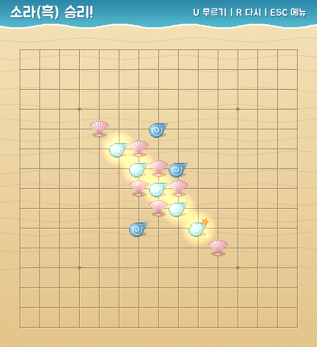
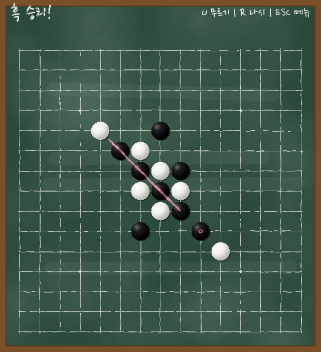

# Omok (오목)

[](https://github.com/jynlee/omokgame/actions/workflows/pages.yml)

Python과 pygame으로 만든 15×15 오목 게임입니다. 2인 대전과 난이도 3단계 AI 대전을 지원하고, 모래사장과 칠판 테마를 고를 수 있습니다.

> 🎮 **브라우저에서 플레이**: 준비 중 (웹 빌드 작업 예정)

| 모래사장 | 칠판 |
|---|---|
|  |  |

## 기능

- **2인 대전**: 한 화면에서 번갈아 둡니다
- **AI 대전**: Easy / Normal / Hard. 사람이 흑(선공)입니다
- **테마 2종**: 모래사장(소라와 조개), 칠판(입체 바둑돌)
- **승리 강조**: 완성된 5목에 금빛 반짝임 또는 분필 선 애니메이션
- **무르기, 다시 시작**: AI 대전에서는 사람 차례로 돌아갈 때까지 무릅니다
- **규칙**: 자유룰. 같은 색 5개 이상 연속이면 승리합니다 (6목 포함, 금수 없음)

## 실행 방법

### 1. 게임 실행

#### 사전 준비

- **Python 3.12 이상**이 설치되어 있어야 합니다. 설치 여부는 아래 명령으로 확인할 수 있습니다.

    ```sh
    python --version
    ```

#### 실행 단계

1.  **저장소 받기:**
    소스 코드를 내려받고 프로젝트 폴더로 이동합니다.

    ```sh
    git clone https://github.com/jynlee/omokgame.git
    cd omokgame
    ```

2.  **가상환경 만들기:**
    이 프로젝트에서만 쓰는 독립된 Python 환경을 만듭니다. 시스템에 설치된 다른 패키지와 섞이지 않습니다.

    ```sh
    python -m venv .venv
    ```

3.  **가상환경 켜기:**
    운영체제에 맞는 명령을 실행합니다. 프롬프트 앞에 `(.venv)`가 붙으면 켜진 것입니다.

    ```sh
    # Windows (명령 프롬프트)
    .venv\Scripts\activate

    # Windows (PowerShell)
    .venv\Scripts\Activate.ps1

    # macOS, Linux
    source .venv/bin/activate
    ```

4.  **의존성 설치:**
    `requirements.txt`에 적힌 패키지(pygame, pytest)를 설치합니다.

    ```sh
    pip install -r requirements.txt
    ```

5.  **게임 시작:**
    창이 열리고 메뉴 화면이 나타납니다.

    ```sh
    python main.py
    ```

#### 조작법

| 입력 | 동작 |
|---|---|
| 마우스 클릭 | 교차점에 돌 놓기, 메뉴 버튼 선택 |
| ← / → (메뉴) | 테마 바꾸기 |
| U | 무르기 |
| R | 다시 시작 |
| ESC | 메뉴로 |
| 상단 [무르기] [다시] [메뉴] 버튼 | U / R / ESC와 같음 (휴대폰에서도 사용) |

### 2. 테스트 실행

규칙, AI, 테마 그리기, 화면 좌표 변환을 검증하는 pytest 테스트 50개가 있습니다. 그중 하나는 Hard AI와 Normal AI를 실제로 끝까지 대국시켜, Hard가 흑과 백 모두에서 이기는지 확인합니다.

#### 사전 준비

- 위 **게임 실행**의 1~4단계(저장소 받기, 가상환경, 의존성 설치)를 마친 상태여야 합니다. pytest는 `requirements.txt`로 함께 설치됩니다.
- 테마 테스트는 창을 띄우지 않고 화면 없는 모드로 그리기를 검사하므로, 별도 설정이 필요 없습니다.

#### 테스트 단계

1.  **전체 테스트 실행:**
    프로젝트 폴더에서 실행합니다. Hard 대 Normal 대국 테스트 때문에 15초 정도 걸립니다.

    ```sh
    python -m pytest
    ```

2.  **테스트별 결과 자세히 보기:**
    각 테스트 이름과 통과 여부를 한 줄씩 출력합니다.

    ```sh
    python -m pytest -v
    ```

3.  **일부만 실행하기:**
    파일이나 테스트 이름으로 골라서 실행할 수 있습니다.

    ```sh
    python -m pytest tests/test_board.py          # 규칙 테스트만
    python -m pytest -k hard_beats_normal         # Hard 대 Normal 대국만
    ```

4.  **오래 걸린 테스트 확인:**
    가장 오래 걸린 테스트 5개와 시간을 함께 보여줍니다.

    ```sh
    python -m pytest --durations=5
    ```

### 3. 웹 빌드

pygbag으로 게임을 웹(WebAssembly)으로 변환합니다. `main` 브랜치에 머지하면 GitHub Actions가 테스트, 빌드, GitHub Pages 배포를 자동으로 진행하고, 테스트가 실패하면 배포하지 않습니다. 아래는 내 PC에서 웹 버전을 미리 확인하는 방법입니다.

#### 사전 준비

- 위 **게임 실행**의 1~3단계(저장소 받기, 가상환경 만들고 켜기)를 마친 상태여야 합니다.
- 브라우저용 Python 실행 환경을 처음 한 번 내려받으므로 인터넷 연결이 필요합니다.

#### 빌드 단계

1.  **개발용 의존성 설치:**
    게임 의존성에 더해 웹 빌드 도구 pygbag을 설치합니다.

    ```sh
    pip install -r requirements-dev.txt
    ```

2.  **빌드 후 미리보기 서버 실행:**
    게임 파일(`main.py`, `omok/`, `assets/`)만 `dist/omokgame/`에 모아 빌드하고 서버를 켭니다.

    ```sh
    python tools/build_web.py --serve
    ```

3.  **브라우저에서 열기:**
    http://localhost:8000 을 엽니다. 처음 로딩은 몇 초 걸립니다. 서버는 `Ctrl+C`로 끕니다.

빌드 파일만 만들려면 `--serve` 없이 `python tools/build_web.py`를 실행합니다. 결과는 `dist/omokgame/build/web/`에 생깁니다.

## 구조

```
omok/
├── board.py        판 상태, 착수, 무르기, 승리 판정 (pygame 의존 없음)
├── ai.py           난이도별 AI (pygame 의존 없음)
├── layout.py       화면 배치 상수
├── game.py         pygame 화면, 입력, 게임 흐름
└── themes/
    ├── common.py   그라데이션, 글꼴 로딩 등 공통 도구
    ├── sand.py     모래사장 테마
    └── chalk.py    칠판 테마
assets/fonts/       Jua, Nanum Pen Script (SIL OFL 1.1)
tests/              pytest 테스트
tools/build_web.py  웹 빌드 스크립트 (pygbag)
.github/workflows/  테스트, 웹 빌드, GitHub Pages 배포
docs/               설계 문서와 구현 계획
```

게임 규칙과 AI는 화면 코드와 분리되어 있어, 화면 없이 테스트할 수 있고 다른 인터페이스(웹 API 등)에서도 그대로 쓸 수 있습니다. 모든 테마는 같은 메서드(`background`, `stone`, `last_mark`, `win_effect`, `text`)를 가지므로 `game.py`는 어떤 테마인지 모른 채 그립니다. 그림은 이미지 파일 없이 코드로 그립니다. 게임 루프는 비동기(`asyncio`)라 같은 코드가 PC와 브라우저에서 모두 동작합니다.

## AI는 어떻게 두나요

**후보 칸**: 이미 놓인 돌에서 2칸 이내의 빈칸만 봅니다.

**점수 매기기**: 후보 칸에 돌을 놓았다고 가정하고, 4방향 각각에서 연속 개수와 양 끝이 열려 있는지를 봅니다.

| 패턴 | 점수 |
|---|---|
| 5목 | 100000 |
| 열린 4 | 10000 |
| 막힌 4, 열린 3 | 1000 |
| 막힌 3, 열린 2 | 100 |
| 막힌 2 | 10 |

칸의 점수는 `1.1 × 공격 점수 + 수비 점수`입니다. 공격에 가중치를 둬서 이길 수 있을 때는 막기보다 이기는 수를 둡니다.

**난이도**

- 모든 난이도는 먼저 **필수 수**를 확인합니다. 바로 5목을 만들 수 있으면 완성하고, 상대가 5목을 만들 수 있으면 막습니다.
- **Easy**: 점수 상위 3개 후보 중 하나를 무작위로 고릅니다.
- **Normal**: 점수가 가장 높은 칸에 둡니다.
- **Hard**: 알파베타 가지치기를 쓴 negamax로 5수 앞까지 읽습니다. 각 단계에서 점수 상위 10개 후보만 살펴보고, 마지막에는 판 위의 연속 패턴 점수로 형세를 평가합니다. 한 수 계산은 PC에서 보통 1초 이내(복잡한 국면은 2~3초), 브라우저에서는 2~3초입니다. 탐색은 수 20개를 읽을 때마다 화면에 차례를 넘기는 제너레이터로 나뉘어 있어, 계산하는 동안에도 화면이 멈추지 않습니다.

처음에는 Hard를 3수 앞까지 읽게 설계했지만, 실제로 대국시켜 보니 Normal에게 졌습니다. 평가 방식을 바꾸고 5수 앞까지 읽게 해서 흑과 백 모두에서 이기도록 고쳤습니다. 과정은 `docs/design/`에 정리해 두었습니다.

## 글꼴 라이선스

[Jua](https://fonts.google.com/specimen/Jua), [Nanum Pen Script](https://fonts.google.com/specimen/Nanum+Pen+Script)는 SIL Open Font License 1.1을 따릅니다. 라이선스 전문은 `assets/fonts/`에 있습니다.

## 앞으로 할 일

- 웹 빌드(pygbag)와 GitHub Pages 배포로 브라우저에서 바로 플레이
- FastAPI로 게임 API 제공
- MCP 서버로 LLM이 오목을 두게 하기
